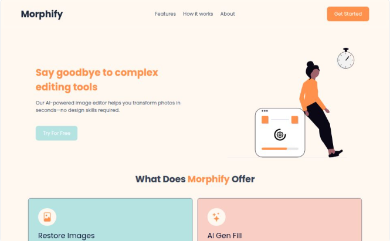

# Morphify 🎨




[](https://morphify-app.vercel.app)
[](./LICENSE)

**Morphify** is a production-ready SaaS platform reimagining how users interact with image editing. By leveraging generative AI, it simplifies complex manipulation tasks—like background removal and generative fill—into a single click.

Built with a focus on **performance**, **scalability**, and **clean architecture**.

---

## 🚀 Key Features

- **🤖 AI-Powered Editing:** Smart background removal, generative fill, and object recoloring.
- **🔐 Modern Authentication:** Secure, session-based auth using **Better Auth (Auth.js v5)**.
- **💳 SaaS Architecture:** Credit-based usage system (prepared for Stripe/Paystack integration).
- **⚡ High Performance:** Server-side rendering (SSR) via **Next.js App Router**.
- **🎨 Responsive UI:** Pixel-perfect design with **Tailwind CSS** and smooth animations.
- **💾 Robust Data Layer:** Type-safe database interactions with **Prisma** & **MongoDB**.

---

## 🛠️ Tech Stack

**Core:**
-  **Framework**
-  **Language**
-  **Styling**

**Backend & Data:**
-  **ORM**
-  **Database**
-  **Authentication**

---

## 🔌 Getting Started

Follow these steps to set up the project locally.

### Prerequisites

- Node.js (v18+)
- MongoDB URI (Local or Atlas)
- Cloudinary/AI API Keys (if applicable)

### Installation

1. **Clone the repository**
   ```bash
   git clone [https://github.com/TheGrandGeiss/morphify.git](https://github.com/TheGrandGeiss/morphify.git)
   cd morphify